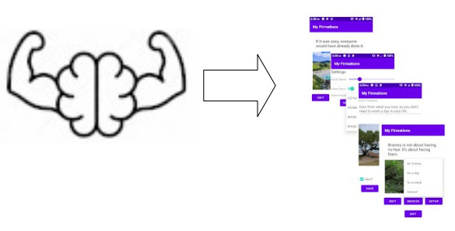

<h1 style="color: #2e6c80;">MyFirmations FAQ</h1>

<h3 style="color: #2e6c80;">What is MyFirmations?</h3>

Myfirmations is an app that presents "firm affirmations"(quotes to keep you grounded). You are able to customize it's content, as well as behaviour such as if and how it speaks to you,  and how fast it automatically scrolls. Check out the <a href ="firmdoc.pdf">user manual</a> and the source Kotlin code!!!.

<h3 style="color: #2e6c80;">Why did you create it?</h3>

This was a practice app to become more proficient in Kotlin, before applying relevant techniques to some more mission critical projects. The idea was born out of the Affirmations app example from the <a href ="https://developer.android.com/courses/android-basics-kotlin/course">Android Basics in Kotlin Course</a>. That project displayed a list of 10 affirmations with images, each of which is on a material card in a recycler view. I saw the opportunity to get some practice, while compiling some sayings that were useful for me to hear when going through tough times.

<h3 style="color: #2e6c80;">What does the app do?</h3>

The resulting app is initialized with 50 quotes that I call "Firmations". On starting the app, the quotes are displayed, one at a time, in a random order with a pre-set scroll speed.The app also speaks the quotes by default, although you can tell the app not to speak. You can also tell the app not to say a particular quote, and to snooze a quote for 5 minutes, a day, a week or forever. You can also edit quote to say exactly what you need to hear, and you can create a copy of a quote (so essentially you can store your own quotes). The settings screen allow you to manage the scroll speed (from 5 seconds to 60 seconds), control whether the system is speaking the quotes, as well as select the voice used to speak the quotes. Currently, 4 voices are available(all english), that represent US female voices, as well as British female and male voices.

<h3 style="color: #2e6c80;">How did you do it(High level overview)?</h3>

The app employs a SQLite data store, a text to speech library, a recycler view, and other widgets to present screen elements. On initial startup the SQLite store is initialized from the resources to populate quote and setting data. A single activity was employed with three fragments for the screens. One fragment, which hosts a recycler view, manages the scrolling with the aid of a tail recursive function that invokes the navigation of the under a delay stored in the app settings. The fragment that manages scrolling allows navigation to the setup activity as well as the edit activity. While away from the fragment that manages scrolling, automatic scrolling is paused.

<h3 style="color: #2e6c80;">What if I want to build on it and distribute?</h3>

At this point, this is a practice app. You should consider the code free to use for non-commercial purposes. All I ask is a mention. I claim no rights over the images used, or the app icon. Images were obtained from https://unsplash.com/ with a search of "Jamaica". The app icon was obtained from https://www.dreamstime.com/. You may recognize a few of the quotes as common sayings- a few others are out of my head. Enjoy, and if you re-use, all I ask is a mention (if applicable).

<h3 style="color: #2e6c80;">Are there any known issues?</h3>

 1. There is a problem on initial install - the app seems to not properly read the settings data the first time it is run, and it needs to be re-loaded  2. Data binding in the code is not fully operational - will revisit  3. There is no need for the recycler view to load (the default) 5 view holders. Code inserted to specify only one view holder to initialize has had no effect to date - will revisit.
 4. The app icon is skewed on the device screen.

There could also be some refactoring in order - all in all this was a quick knockout of something that is at version 0.9, but is functional.
